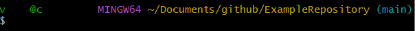
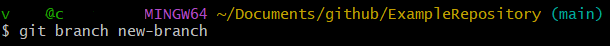
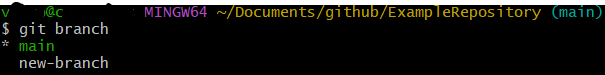

# Creating branches in git bash

Branches can be created through various means, but always through the git-own tools such as git bash.

First, open git bash in the project directory or navigate there with

~~~git
cd 'path/to/project'
~~~

You should now see a branch name next to the working directory path, usually (main).

To create a new branch, enter

~~~git
git branch new-branch
~~~

With 

~~~git
git branch
~~~

you can view all existing branches:

---

Here's the official Git [git branch documentation](https://git-scm.com/docs/git-branch)