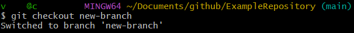
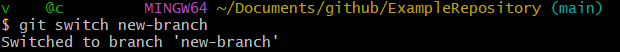

# Switching branches in git bash

After having created a new branch you can swtich branches either with

~~~git
git checkout <branch-name>
~~~

or with 

~~~git
git switch <branch-name>
~~~

But why have two commands that can do the same thing? Git checkout is not only able to switch branches, but also switch between commits. Git switch can only switch branches, and git restore is able to switch between commits. Git switch and git restore were introduced at the same time, for the purpose of splitting the two functionalities of git checkout.

---

Here's the official Git [git checkout documentation](https://git-scm.com/docs/git-checkout) and the [git switch documentation](https://git-scm.com/docs/git-switch)