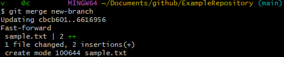

# Merging branches in git bash

After having commited and pushed the code of a feature into a branch, you have to merge it with the main branch (or any other branch of your choice) to include the new feature.

~~~
	 A---B---C branch
	/
---D---E---F---G main
~~~

Merging branch into main integrates the changes made in branch with the changes or main. The commits C and G will be merged together. 

If you worked on the same classes or documents in branch and main, you will create a merge-comflict. To resolve it, best use an IDE and decide which chzanges to keep. 

~~~
	 A---B---C branch
	/         \
---D---E---F---G---H master
~~~

You don't have to merge a branch and its' parent brancch though, it is also possible to merge directly into the parent branch of the parent branch or into a different branch altogether. 

You have to do the merge from the branch you want to merge into. 

~~~git
git merge <branch-name>
~~~

---

Here's the official Git [git merge documentation](https://git-scm.com/docs/git-merge)
