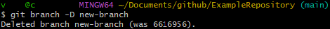
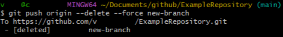

# Deleting branches in git bash

After a branch has been merged, one might want to delete it.

Branches can be deleted locally and for the remote repository. To delete one locally, use

~~~git
git branch -d <branch-name>
~~~

or 

~~~git
git branch -D <branch-name>
~~~

Deleting branches in the remote repository is slightly more tricky: 

~~~git
git push origin --delete <branch-name>
~~~

This command addresses the remote origin, the repository and not the local branch. 

-d is short for --delete and -D is short for --delete --force.

---

Here's the official Git [git branch documentation](https://git-scm.com/docs/git-branch), see -d under options.