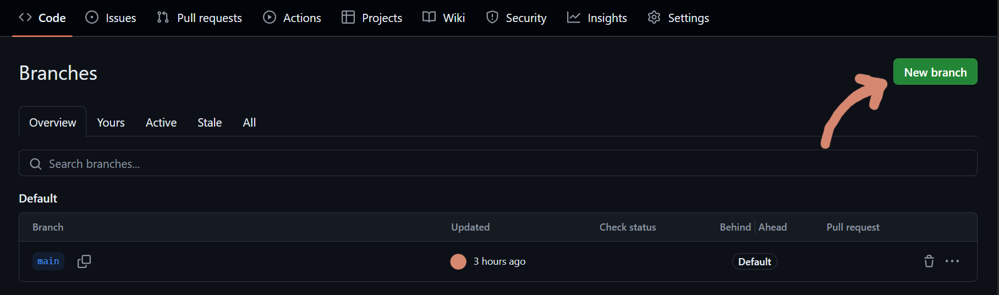
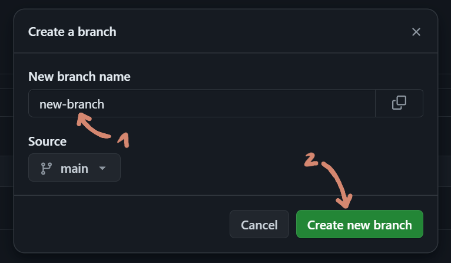
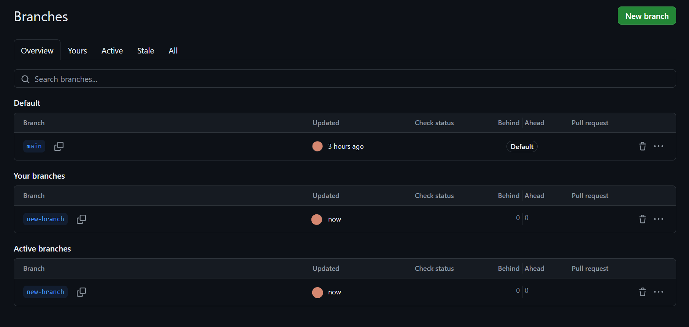
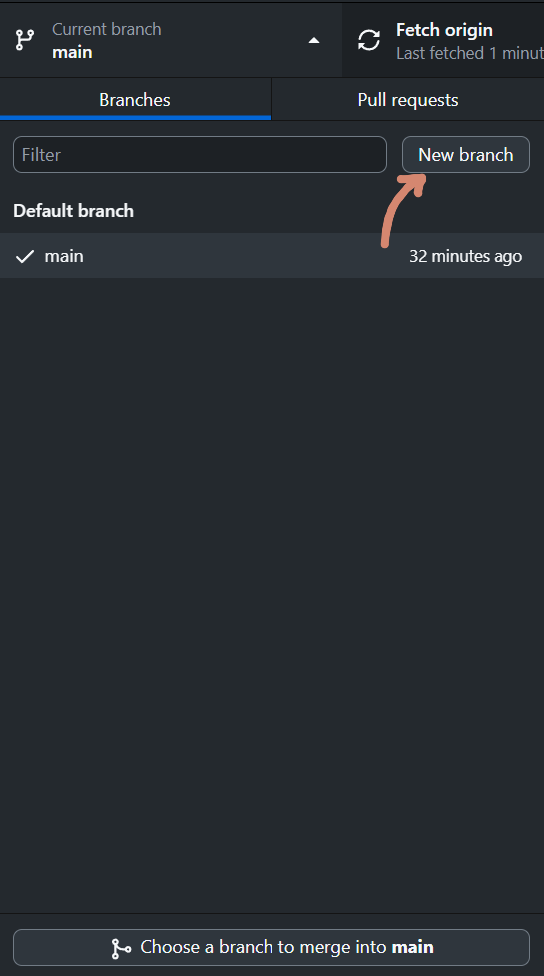
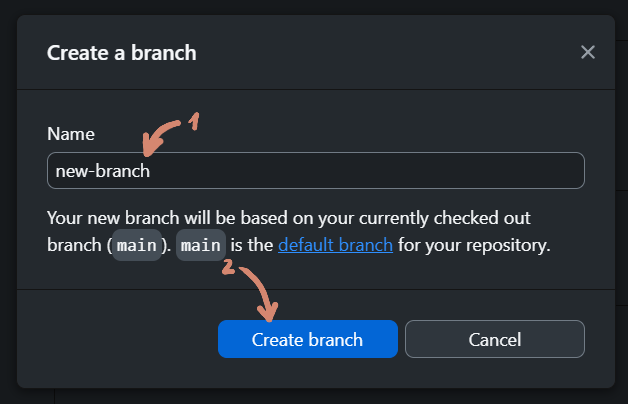
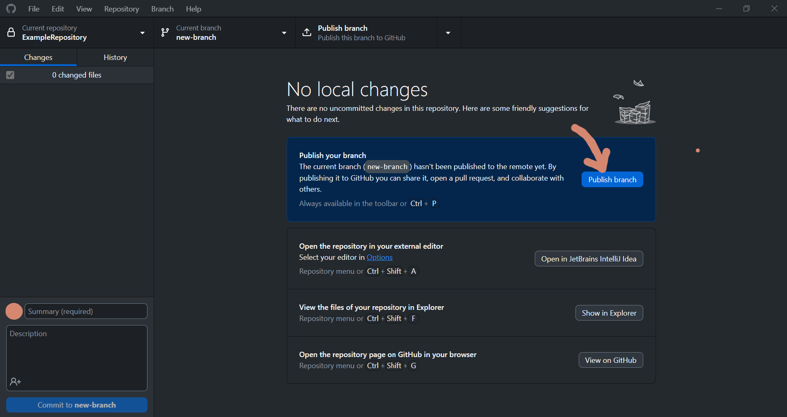

# Creating branches on GitHub

Branches can be created either on the GitHub website or in GitHub Desktop. 

To create a new branch on the website, first select "Branch" in the upper left of the repository main page: 

then select "New branch" in the upper right:

and enter the name of the branch (1). Then select "Create new branch" (2):

Now your new branch appeared on the branches overwiew:

---

When doing this on the Desktop Version, first click on the name of your current branch in the menu bar:

then on "New branch":

enter the name (1) and select "Create branch" (2):

Now you're going to have to push the branch to origin, so to the repository:

