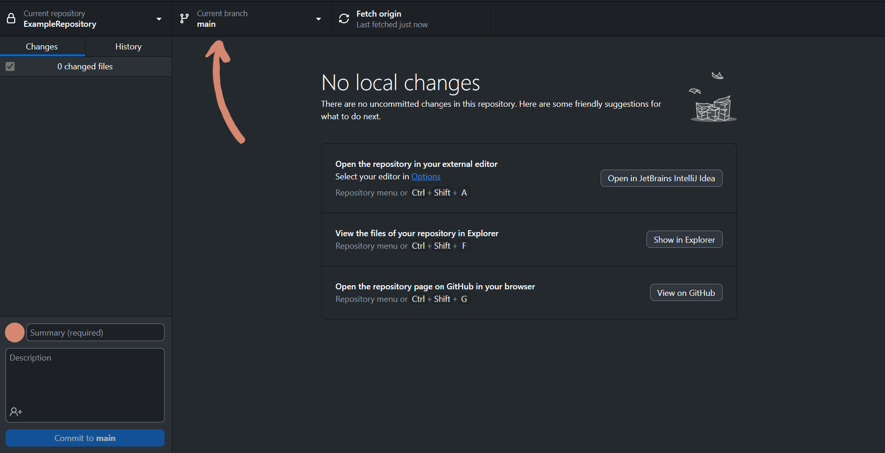
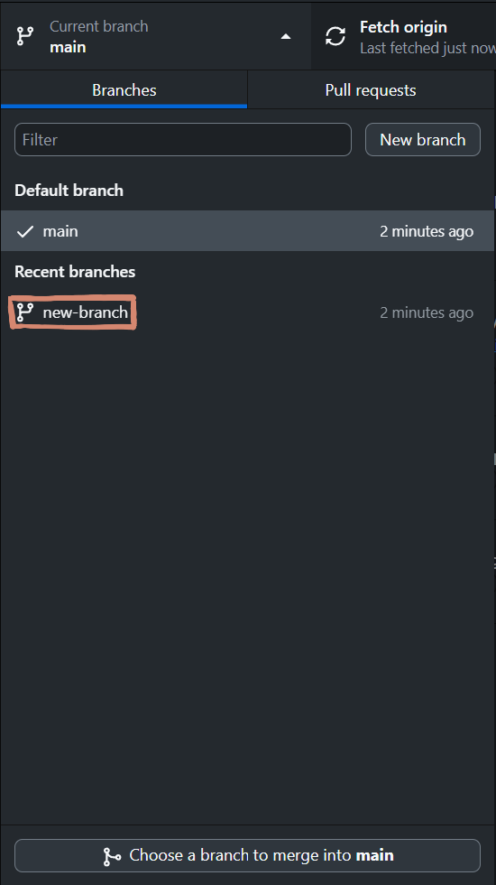

# Switching branches on GitHub

Switching branches is only really possible in GitHub Desktop, since that refers to your local version, and the GitHub website refers to the remote repository. 

To switch branches, click on the branches overwiew:;

and then the branch you want to switch to:

when "switching" on the website, you are also able to view the files as they are on that branch. 

-image