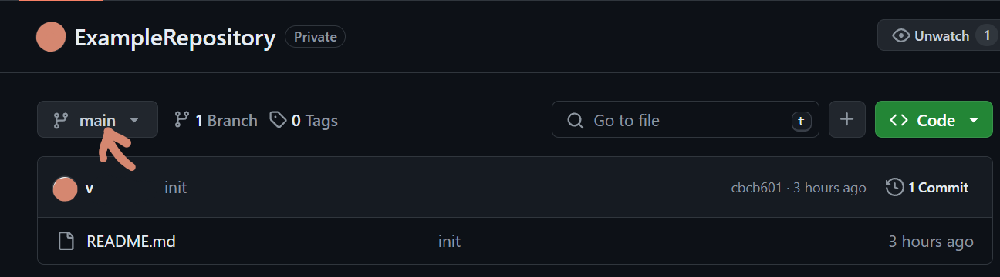
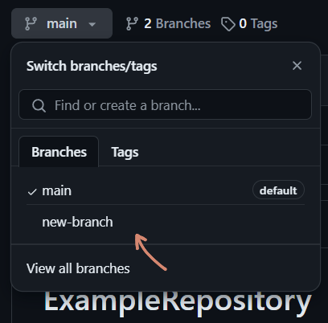

# Switching branches on GitHub

Swtiching branches is slightly different on the website and in the Desktop application. Switching in the desktop application changes your local copies, they transform into those in thge branch. The website only displays which files are in the branch. This is why you should commit all your changes before changing the branch locally, but it is not relevant when viewing other branches over the website.

To view other branches on the websiteyou have to select the Branch you are currently in:

and then click on the branch you want to switch to:

---

To switch branches from the Desktop application, click on the branches overwiew:

and then the branch you want to switch to:

