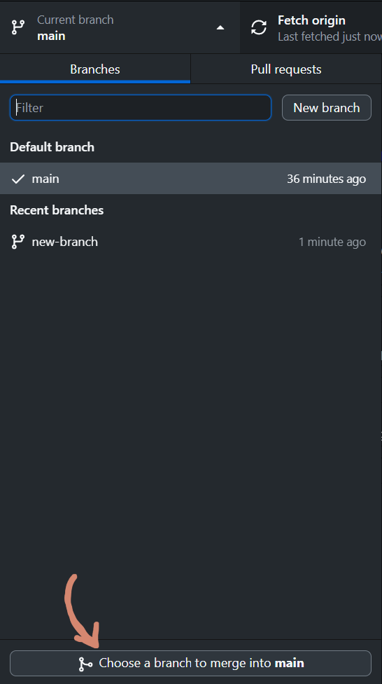
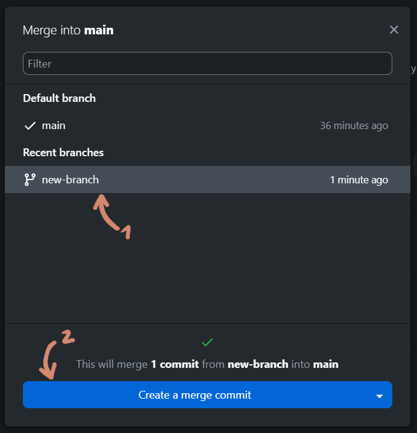
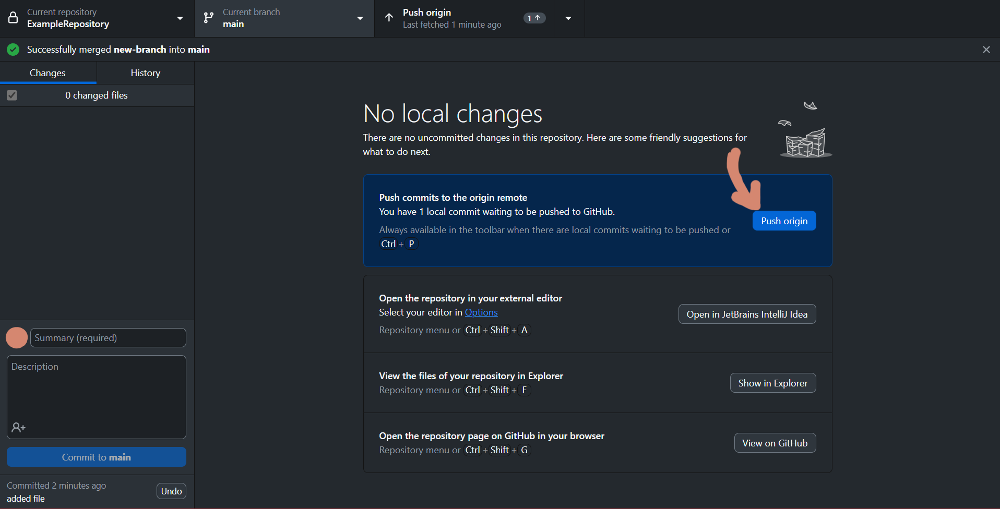

# Merging Branches in GitHub

Merging Branches is possible through pull requests and manually, with the git merge command. 

To merge branches, first switch to the branch you want to merge into. Then click on the branches tab in GitHub Desktop:

then on "Choose a branch to merge into < branch-name >:

Then select the branch you want to merge (1) and click "Create a merge commit" (2):

Lastly, you need to push the merge to origin, so to the repository:

