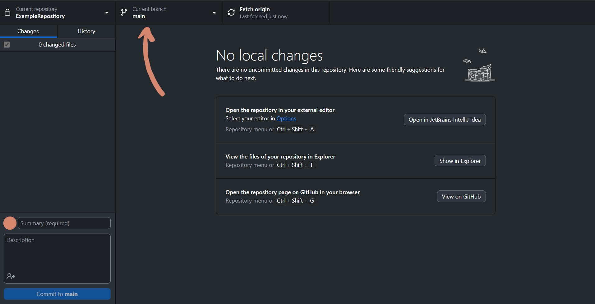

# Deleting Branches in GitHub

Sometimes, branches become obsolete. Instead of letting them rot until you finish your project, best delete them directly. 

To delete Branches on GitHubs website, you also have to enter the branch menu: 

and then click on the trashcan next to the branch you want to delete:

---

To delete branches in GitHub Desktop, enter the branches menu:

right-click on the branch you want to delete and select "Delete":

