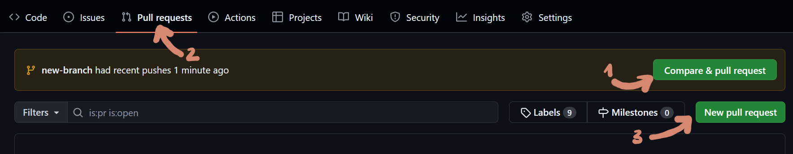
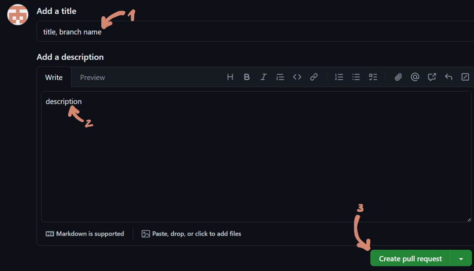

# Open a pull request

There are two ways to open a pull request. Either GitHub already suggests creation one (1), or you can click on the Pull requests tab (2) and select "New pull request" (3):

Then enter a title (1) and a detailed description (2) of every new feature contained in the pull request, and select "Create pull request" (§)

