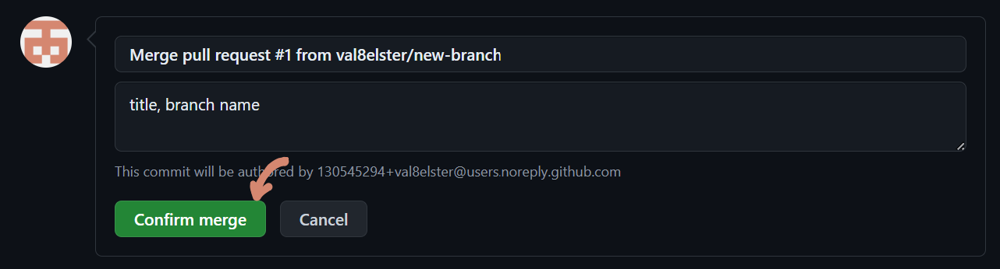

# Close a pull request

There are two ways to close pull requests: either by accepting, and therefore merging, or denying. 

You should never merge your own pull requests. Usually, someone else should look over your code, determine whether it works and then merge it. Merging a pull request works by selecting the pull request from the list unter the oull request tab and then clicking on "Merge pull request":

and then "Confirm merge":

It sometimes happens that merge conflicts result out of working in the same file in different branches, and then trying to merge these branches together: 

Click on "Resolve Conflicts" (1), and after resolving, proceed as usual (2).

Now GitHub suggests to delete the branch. If you don't plan on working in this branch anymore and don't want to keep it as a backup, it is advised to delete it:

---

If you don't want to merge a pull request, you can also close it by clicking on "Close pull request" below the merge window:

and the pull request will show up as canceled. GitHub will also offer to delete the branch at this stage :

